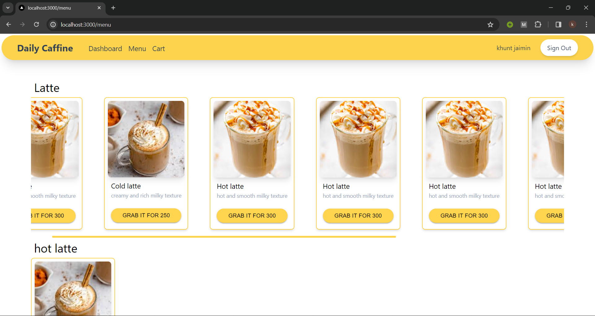

# Daily_Caffine
To Start this project  
make a .env.local file 
add following to it 
MONGO_URL(URL of Your Database) 
CLIENT_ID(Client ID of Google oauth) 
CLIENT_SECRET(Client Secret of Google oauth) 
NEXTAUTH_URL(http://localhost:3000) 
NEXTAUTH_SECRET(get special string by command openssl rand -base64 32 or r2728Q8RG+Khgs0Ai7vyqBHjAsr1V083LB6ueSrAY48=)

after you added all 
run command npm run dev in my_coffee_app dir. 
project will start running at port 3000 (http://localhost:3000) 

images:

